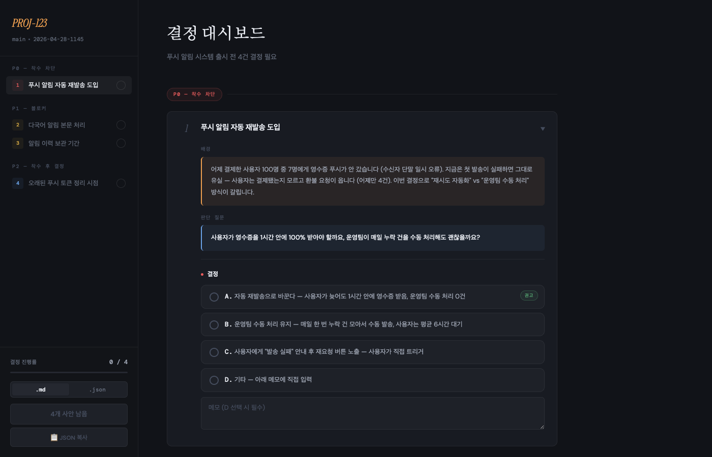

# elian-claude-plugins

[](LICENSE)
[](https://github.com/Elian-Studio/elian-claude-plugins/releases)
[](plugins/elian-store/)
[](scripts/rubric.md)

> **결정 피로를 줄이고 워크플로우를 매끄럽게 만드는 Claude Code 스킬 번들.**
> 한 번의 플러그인 설치(`elian-store`) 로 여러 스킬을 함께 받고, 새 스킬이 추가되면 자동 업데이트됩니다.
> 모든 SKILL.md 변경은 90점 품질 게이트(휴리스틱) 를 통과한 PR 만 main 에 반영됩니다.

---

## 🚀 Quick Start

```shell
/plugin marketplace add Elian-Studio/elian-claude-plugins
/plugin install elian-store@elian
```

이후 Claude Code 에서:

> "결정 사안이 4건 쌓였어. 결정 대시보드 만들어줘"

→ `elian-store` 안의 `decision-dashboard` 스킬이 자동 호출되어 인쇄 가능한 HTML 대시보드가 생성됩니다. 명시 호출은 `/elian-store:decision-dashboard`.

---

## 📦 elian-store 에 포함된 스킬

| 스킬 | 상태 | 설명 | 호출 |
|------|------|------|------|
| [decision-dashboard](plugins/elian-store/skills/decision-dashboard/) | ✅ v1.0.0 | 3개 이상의 결정이 쌓인 순간, 인쇄 가능한 단일 HTML 산출물로 캡처해 5분 안에 A/B/C 선택 가능하게 만듭니다. | `/elian-store:decision-dashboard` |
| manage-skills | 🔮 예정 | 세션 변경사항 분석 + 검증 스킬 드리프트 자동 탐지 | `/elian-store:manage-skills` |
| brainstorm | 🔮 예정 | 기획+설계 인터랙티브 브레인스토밍 | `/elian-store:brainstorm` |
| commit | 🔮 예정 | 구조화된 커밋 메시지 + Co-Authored-By 처리 | `/elian-store:commit` |

새 스킬 추가는 별도 설치 없이 `/plugin update elian-store@elian` 한 번으로 반영됩니다.

---

## 🎯 decision-dashboard — 어떤 화면이 나오나요?



좌측 사이드바는 결정 사안을 우선순위별로 그룹핑(P0/P1/P2). 우측은 펼친 카드의 배경 → 판단 질문 → 옵션(A/B/C/D + "기타 — 직접 입력") → 메모 흐름. 하단에 진행률과 JSON/MD 다운로드 버튼.

### 사용 시나리오

**Before** — 채팅에 결정 사안 4건이 길게 늘어져 있고 PO 가 끝까지 안 읽음. 결정 부재로 다음 단계가 막힘.

**After** — `decision-dashboard` 호출 → 카드 4개 자동 생성 → 브라우저로 PO 에게 공유 → 5분 후 JSON 받음 → 후속 스킬이 그 JSON 을 컨텍스트로 진행.

핵심 원칙:
- **카드 본문 LANGUAGE GATE** — 클래스명/테이블명/내부 약어 자동 차단. 결정자는 코드를 보지 않아도 됨
- **"기타 — 직접 입력" 옵션 필수** — 제시된 선택지가 부적합할 때의 도주로
- **2-mode 분리** — `generate` (첫 생성) / `finalize` (영구 JSON + HTML 정리)
- **Persistent artifact** — `decisions-final.json` 이 후행 스킬에 컨텍스트로 전달됨

자세한 사용법: [`plugins/elian-store/skills/decision-dashboard/SKILL.md`](plugins/elian-store/skills/decision-dashboard/SKILL.md)

---

## 🔄 업데이트

```shell
/plugin marketplace update elian
/plugin update elian-store@elian
```

새 스킬이 추가되면 자동으로 함께 받아집니다.

---

## ⚠️ v1.x → v2.x 마이그레이션

v1.x 의 `decision-dashboard` 플러그인이 v2.0.0 부터 **`elian-store` 번들 안의 한 스킬**로 재배치됐습니다. 다수 스킬을 묶어 한 번 설치하기 위함입니다.

이미 v1.x 를 설치했다면:
```shell
/plugin uninstall decision-dashboard@elian
/plugin install elian-store@elian
```

호출 형식 변경:
```
/decision-dashboard:decision-dashboard   →   /elian-store:decision-dashboard
```

자연어 호출("결정 대시보드 만들어줘") 은 변동 없음.

---

## 📜 라이선스

MIT (`plugins/elian-store/.claude-plugin/plugin.json` 참조)

---

## 🤝 기여 / 자체 수정 / 메인테이너 가이드

이 마켓플레이스에 PR 을 올리거나 본인 fork 를 운영하려면 [`CONTRIBUTING.md`](CONTRIBUTING.md) 참조 — 워크플로우, 로컬 검증, 평가 기준, 새 스킬 추가 절차, 브랜치 보호/릴리즈 절차가 한 곳에 정리되어 있습니다.

상세 변경 이력은 [`CHANGELOG.md`](CHANGELOG.md), 릴리즈 노트는 [Releases](https://github.com/Elian-Studio/elian-claude-plugins/releases) 탭 참조.
