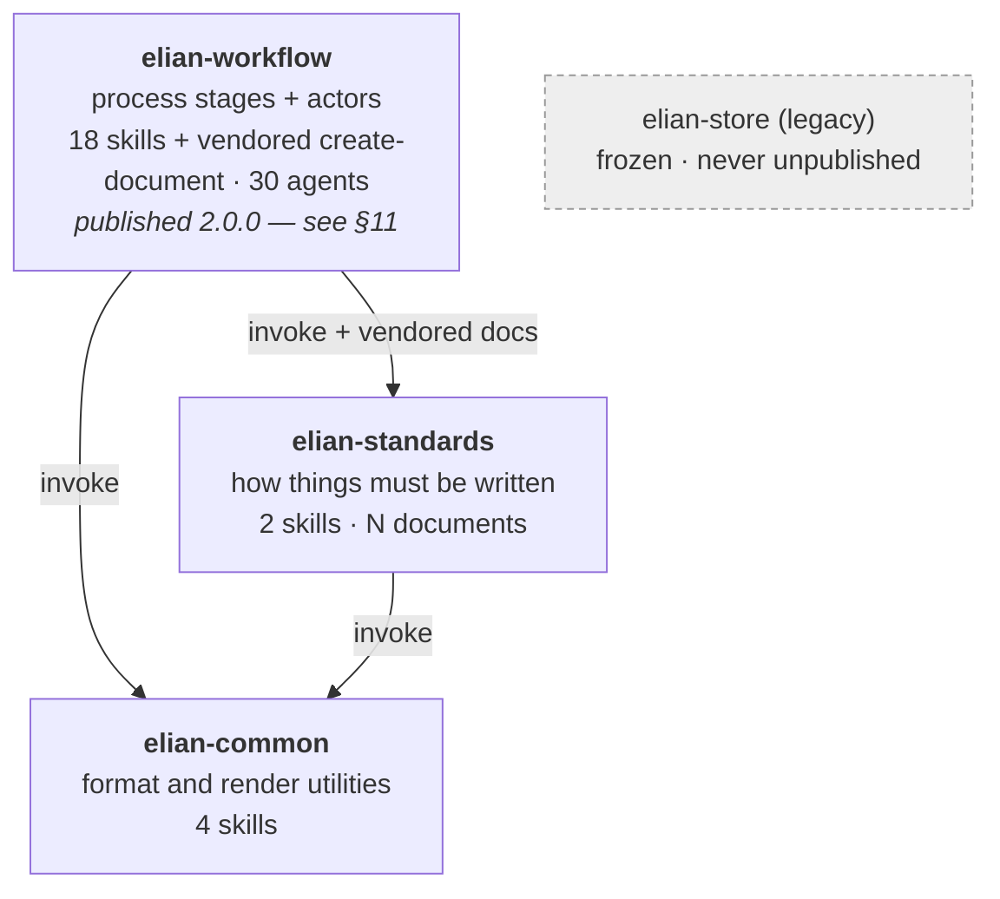

# Plugin layering architecture

Date: 2026-07-29
Status: **partially executed.** The Workflow layer was published as `elian-workflow` 2.0.0 —
see §11. Standards and Common remain proposed. Supersedes the two-cluster grouping in
`tools/clusters.json` (2026-07-29), which grouped by "needs a repo / does not" rather than by
responsibility.

Companion to [plugin-portfolio-hybrid-model.md](plugin-portfolio-hybrid-model.md), which owns
the *publishing* decision. This document owns the *layering* decision. They are separable, and
that separation is the central recommendation here.

---

## 1. Problems in the current structure

24 skills across two plugins, measured rather than assumed.

### 1.1 Conventions are mostly fine. The duplication is in code.

An earlier draft of this section claimed six duplicated conventions. A line-by-line audit
found that **five of the six were wrong**, and that the largest duplication in the tree was
not a convention at all. The corrected picture:

| Candidate | Audit verdict | Extractable |
|---|---|---|
| Direct vs subagent vs agent-team | **Single source, correctly used.** All four consumers link `_shared/execution-strategy.md`; none restate it. What looked like a restatement is a one-line citation placeholder | 0 |
| Dev-history narrative format | Single source, extracted deliberately | 0 |
| TDD discipline | **Not duplicated.** `implement` (3-step red-green-refactor), `fix` (4-step, regression test first), `improve` (6-step, protect existing tests then characterize) are *three different disciplines* sharing a vocabulary. Unifying them would require inventing a rule none of them states | ~3 |
| Review severity + finding shape | **True duplication, already drifted** in four of five rubric rows | **~20** |
| PR/MR body conventions | **Not duplicated across skills.** `pr-review` only consumes a PR body; `respond-to-review` explicitly disclaims the concern. Real duplication exists only between `pr-writer` and its own `references/pr-style.md` | 0 |
| Verification evidence rules | **Already single source.** `verify-before-claiming` defines them; `spec-coverage` cites rather than copies; `verify-implementation` states none | 0 |
| Document house style | **Not duplicated.** `document-writer`, `create-document`, and `erd-preview` use three unrelated design systems — no shared variable, value, or font | 0 |

The lesson is worth keeping: a shared vocabulary is not shared rules. Three skills all saying
"TDD" were doing three different things, and merging them would have destroyed information.

**The actual duplication was in code, and it was larger than any of the prose:**

| Item | Measured | Size |
|---|---|---|
| `validate_skill.py` | Four **byte-identical** copies (`brainstorm`, `fix`, `implement`, `improve`), 207 lines each. Changing a rule meant four edits or three silent divergences | **621 lines** |
| `SKILL_DIR` dual-host resolution snippet | 18 occurrences across 8 files. `decision-dashboard/SKILL.md:282` already logs getting this wrong as a documented pitfall | ~36 lines |
| `execution-strategy` phase table | Drawn twice — the shared file and `generate-teammate/approach-selection.md` — with drift | ~15 lines |

So the Standards layer is architecturally correct but **thin**: one extracted rubric plus the
two documents that were already extracted. That is not an argument against the layering; it is
an argument against assuming duplication exists because a taxonomy predicts it.

### 1.2 Coupling is structural where it should be behavioral

Two kinds of dependency exist, and they behave completely differently at a plugin boundary:

- **Invocation** (`/create-document`) — resolved by the host at runtime. Crosses plugin
  boundaries freely. 19 skills participate in a dense invocation graph.
- **Relative path** (`../create-document/templates/x.html`) — resolved by the filesystem.
  **Cannot cross a plugin boundary.** A plugin is copied as a unit; `../` escapes it.

Measured relative-path dependencies:

| From | To | Survives a Workflow/Common/Standards split? |
|---|---|---|
| `decision-dashboard` → `create-document/{templates,schemas,references}` | Common → Common | yes |
| `update-design` → `design-feature/references/*-guide.md` | Workflow → Workflow | yes |
| `implement`, `fix`, `improve` → `_shared/execution-strategy.md` | Workflow → Standards | **no** |
| `generate-teammate` → `_shared/execution-strategy.md` | Workflow → Standards | **no** |
| `generate-teammate` → `create-document/{templates,schemas}` | Workflow → Common | **no** |
| `issue-open`, `issue-close` → `_shared/narrative-template.md` | Workflow → Standards | **no** |

Four of six crossings break. Any split proposal that does not name a mechanism for these is
not implementable.

### 1.3 `generate-teammate` welds unrelated concerns together

It is the most-used skill in the catalog (453 invocations) and the only one that hard-references
*both* `_shared` and `create-document`. It also owns the 14 `domain` agents, is invoked by five
workflow skills, and invokes five back. It is not a pipeline stage and not a format utility — it
is a cross-cutting execution concern, and it is what makes a naive two-way split impossible.

### 1.4 Naming already collides

`tools/clusters.json` currently defines a cluster named `elian-common` containing
`design-feature`, `intake-spec`, and `update-design` — skills that are deeply workflow-aware.
Under the layering below, "Common" means the opposite: zero workflow knowledge. The name must
be redefined before it is published, or it will mean two different things in two documents.

### 1.5 Low reuse concentrated in the design lane

Five skills sit at ≤3 invocations. Four were retired in 4.0.0 on that evidence. The survivors
in the design lane (`design-feature` 16, `update-design` 15, `erd-preview` 1) are narrow and
tightly chained to one another, which is a reuse problem the layering does not fix — noted here
so it is not mistaken for something the split solves.

---

## 2. Target architecture

Three layers, strictly ordered. A layer may depend downward and never upward.



Allowed: `Workflow → Standards → Common`, and `Workflow → Common` directly.
Forbidden: any edge pointing up. `Common` imports nothing. A cycle is a build failure.

The layering answers "who is allowed to know what":

- **Workflow** knows *when* — the order of stages and which skill runs at each.
- **Standards** knows *how* — the shape a commit, PR, test, review, or document must take.
- **Common** knows *what format* — how to turn structured input into HTML, Markdown, or JSON.

Common never learns a stage name. Standards never learns a stage order.

---

## 3. Plugin responsibilities

### 3.1 `elian-workflow`

**Purpose.** Own the development process: which stage comes next, and which skill runs there.

**Responsibility.** Stage sequencing, stage entry/exit conditions, handoffs between stages, and
the agents that act inside a stage.

| Stage | Skills |
|---|---|
| Idea | `brainstorm` |
| Spec / PRD | `intake-spec` |
| Issue | `issue-open` |
| Architecture | `design-feature`, `update-design` |
| Implementation | `implement`, `fix`, `improve` |
| Review | `review`, `persona-review`, `pr-review`, `respond-to-review` |
| Test / Verify | `spec-coverage`, `verify-implementation`, `verify-before-claiming` |
| Release | `pr-writer` |
| Record / Retrospective | `issue-close` |
| Cross-stage | `generate-teammate` (execution routing) |

Plus all 30 agents (14 `domain`, 16 `reviewers`) — agents are workflow actors, and they are
auto-discovered from the plugin's own `agents/` directory, so they must live with their consumers.

**Must not contain.** Any renderer, formatter, parser, or converter *of its own*. Any convention
document. If a workflow skill needs to produce HTML it goes through Common, and if it needs to
know the required shape of its output it reads a vendored Standards document.

**Amended by §7 step 3.** "Goes through Common" turned out to mean *carrying* Common's renderer,
not invoking it across a plugin boundary: three Workflow skills execute
`create-document/scripts/*.py` by path, and a path that leaves the plugin does not survive
install. The shipped 2.0.0 therefore vendors `create-document`. The rule that matters is the
dependency *direction* — Workflow may depend on Common, never the reverse — not whether the
bytes are duplicated.

### 3.2 `elian-standards`

**Purpose.** Be the single source of truth for every convention, and keep those conventions
internally consistent.

**Responsibility.** Convention documents, plus the two skills whose job is convention integrity.

| Kind | Item | Status |
|---|---|---|
| Document | `execution-strategy.md` | already extracted, four consumers, no drift |
| Document | `review-severity.md` | **extracted 2026-07-29** — reconciled the drifted `review` / `pr-review` rubrics |
| Document | `dev-history-narrative.md` | already extracted (`elian-workflow/skills/_shared/narrative-template.md`) |
| Skill | `manage-skills` | authors and repairs project `verify-*` convention checks |
| Skill | `harness-manager` | reconciles rule files across Claude and Codex harnesses |

Three documents, not the seven an earlier draft projected. `tdd.md`, `git-convention.md`,
`verification-evidence.md`, and `document-house-style.md` were all dropped after the audit in
§1.1 found nothing to extract. The layer is real but small, and it should stay small — a
Standards document earns its place by removing a duplicate, not by filling a category.

Domain-specific rubrics stay with their owner: `agents/security-engineer.md` ranks by
exploitability and `agents/ux-researcher.md` by task completion. Neither belongs on the
engineering severity scale, and forcing them onto it would lose the distinction.

**Must not contain.** Stage order. Any knowledge of when a convention applies — only what it is.
`manage-skills` and `harness-manager` belong here because both exist solely to keep conventions
consistent; they enforce rules, they do not sequence work.

**Why documents rather than skills.** A convention is read, not run. Making each one a skill
would put a dozen entries in the always-loaded skill list for content that is only needed once
a stage has already started.

### 3.3 `elian-common`

**Purpose.** Turn structured input into a rendered artifact. Reusable in any project, including
projects with no code at all.

| Skill | Job |
|---|---|
| `create-document` | Render schema-validated JSON through bundled HTML/Markdown templates |
| `document-writer` | Turn arbitrary content into one self-contained document |
| `erd-preview` | Turn a schema plus real rows into a lineage-explorer HTML |
| `decision-dashboard` | Turn a decision set into a printable HTML plus a JSON artifact |

**Must not contain.** Any mention of a stage, an issue tracker, a branch, a test suite, or a
review. `decision-dashboard` qualifies only because its input is a decision *set* — it does not
know that decisions arise in a design phase.

**On the wider utility list.** Markdown, Mermaid, UML, JSON, YAML, CSV, SQL, technical writing,
business writing, email, translation, summarization, and validation were all proposed as Common
members. Only four exist. Building the rest now would be speculative expansion, which
`plugin-portfolio-hybrid-model.md` Operating Principle 8 forbids: a gap in a taxonomy is not a
reason to add a skill. Treat the list as a **placement rule for future skills**, not a build
backlog — when one of them is genuinely needed, it lands in Common without further debate.

### 3.4 `elian-store` (legacy)

Frozen at 4.0.0. Receives no new skills. **Never removed from the marketplace** — the catalog
has no `deprecated` / `replaces` / `alias` field, so deleting the entry silently orphans every
existing install. It is a compatibility shim, not part of the target architecture.

---

## 4. Crossing the boundaries

Four relative-path dependencies break under this split. Each needs an explicit mechanism.
As of 2026-07-29 only §4.2 remains outstanding, and it only bites if the plugins are actually
published — see §8.

### 4.1 Standards documents → `skills/_shared/`, already solved

Every Standards document currently has all of its consumers inside one plugin, so no mechanism
is needed beyond the one that already exists: `skills/_shared/` plus `"shared": true` in
`tools/clusters.json`, which `tools/generate.py` copies into each emitted cluster. Verified —
`_shared/execution-strategy.md` and `_shared/review-severity.md` both resolve inside
`dist/marketplace/plugins/*/`.

A root `standards/` directory with a `standards: [...]` manifest key, build-time vendoring, and
a byte-parity validator was designed for the cross-plugin case. **Build it when a standard
actually has consumers in two plugins, not before** — three documents behind one boundary do
not justify a second copy mechanism.

### 4.2 `generate-teammate` → `create-document` → invocation

`generate-teammate` currently reads `create-document`'s templates and schemas as files. It must
instead **invoke** `/create-document` with its payload. Behavioral dependency, crosses the
boundary legally, and removes the one edge that would otherwise force the execution router and
the document renderer into the same plugin.

This is the single highest-value refactor in the plan: it is what makes Workflow and Common
separable at all.

### 4.3 Rule: no new relative path may cross a skill directory

Enforced in `scripts/validate_repository.py`: a `../<other-skill>/` reference is an error unless
the target is `_shared/` or `_standards/` within the same plugin. Without this, the next
convenient shortcut re-welds the layers.

---

## 5. Directory structure

Two shapes, because layering and packaging are separable (§8). **The first is what the
repository looks like today** after the 2026-07-29 work; the second is what publishing would
add. Nothing below requires a root `standards/` directory.

**Today — layered inside the existing plugins:**

```text
elian-claude-plugins/
├── .claude-plugin/marketplace.json        # 2 entries: elian-store, elian-workflow
├── plugins/
│   ├── elian-store/
│   │   ├── agents/                        # 30 — domain(14) + reviewers(16)
│   │   └── skills/
│   │       ├── _shared/                   # the Standards layer, vendored into each cluster
│   │       │   ├── execution-strategy.md
│   │       │   └── review-severity.md
│   │       └── <22 skills>/
│   └── elian-workflow/
│       └── skills/
│           ├── _shared/                   # narrative-template.md, notion-workspace-config.md
│           ├── issue-open/
│           └── issue-close/
├── codex/                                 # independent tree, symlinks into plugin sources
├── tools/
│   ├── clusters.json                      # layer membership + `shared: true`
│   ├── generate.py                        # emits the layers to dist/, unpublished
│   └── validate_skill.py                  # one shared structural validator
├── scripts/validate_repository.py         # plugin-agnostic contract enforcement
└── docs/
```

**If published — `tools/generate.py --emit` already renders this into the gitignored `dist/`:**

```text
dist/marketplace/
├── .claude-plugin/marketplace.json
└── plugins/
    ├── elian-workflow/   skills/_shared/ + 18 workflow skills + agents/
    ├── elian-standards/  skills/_shared/ + manage-skills/ + harness-manager/
    └── elian-common/     create-document/ document-writer/ erd-preview/ decision-dashboard/
```

The published shape is generated, never hand-maintained. `elian-store` remains a separate,
frozen marketplace entry in either shape.

---

## 6. Migration plan

| Current skill | Target plugin | Reason |
|---|---|---|
| `brainstorm` | Workflow | Idea stage. Its output is a handoff decision, not an artifact format |
| `intake-spec` | Workflow | Spec stage; produces `spec.json` for the next stage |
| `issue-open` | Workflow | Issue stage entry |
| `design-feature` | Workflow | Architecture stage; sequences five gated phases |
| `update-design` | Workflow | Architecture-change propagation; hard-refs `design-feature` (same plugin, stays legal) |
| `implement` | Workflow | Implementation stage |
| `fix` | Workflow | Implementation stage (defect path) |
| `improve` | Workflow | Implementation stage (behavior-changing refactor path) |
| `review` | Workflow | Review stage |
| `persona-review` | Workflow | Review stage; needs the `reviewers` agent group |
| `pr-review` | Workflow | Review stage; needs the `reviewers` agent group |
| `respond-to-review` | Workflow | Review stage, consumer side |
| `spec-coverage` | Workflow | Test stage — binds acceptance criteria to real test results |
| `verify-implementation` | Workflow | Test stage — runs the project's convention checks |
| `verify-before-claiming` | Workflow | Test stage — claim-time gate |
| `pr-writer` | Workflow | Release stage. Its *conventions* move to Standards; the drafting stays |
| `issue-close` | Workflow | Record stage. Its *narrative format* moves to Standards |
| `generate-teammate` | Workflow | Cross-stage execution routing; needs the `domain` agent group. **Requires 4.2 refactor first** |
| `manage-skills` | Standards | Authors and repairs convention-check skills — convention integrity, not a stage |
| `harness-manager` | Standards | Reconciles rule files across harnesses — convention integrity |
| `create-document` | Common | Pure JSON+schema → template renderer; zero stage knowledge |
| `document-writer` | Common | Content → self-contained document. House style moves to Standards |
| `erd-preview` | Common | Schema + rows → HTML; input can be pasted query results |
| `decision-dashboard` | Common | Decision set → HTML + JSON; a renderer, not a decision process |
| `_shared/execution-strategy.md` | Standards (`skills/_shared/`) | Already single-source with four consumers; stays put |
| `_shared/review-severity.md` | Standards (`skills/_shared/`) | Extracted 2026-07-29 from the drifted `review` / `pr-review` rubrics |
| `_shared/narrative-template.md` | Standards (`skills/_shared/`) | Format definition consumed by two Workflow skills |
| 30 agents | Workflow | Auto-discovered per plugin; must live with the skills that dispatch them |

**Nothing moves out of `elian-store`.** It stays frozen and published as-is. The new plugins are
built alongside it from the same skill sources, exactly as `elian-workflow` was.

---

## 7. Refactoring order

Each step ends green on `validate_repository.py` + `generate.py` + the test suite before the
next begins. Steps 1–3 deliver most of the value and are independently useful even if packaging
is never published.

1. ~~**Extract Standards content.**~~ **Done, and far smaller than projected.** The §1.1 audit
   cancelled five of six planned extractions. What shipped: `_shared/review-severity.md`,
   reconciling the two drifted rubrics. `execution-strategy.md` and `narrative-template.md`
   were already single-source. The real deduplication turned out to be code — see step 2.
2. ~~**Build the vendoring mechanism.**~~ **Deferred, and probably unnecessary.** A root
   `standards/` directory with build-time vendoring and a byte-parity validator is a lot of
   machinery for three documents whose consumers all sit inside one plugin. `skills/_shared/`
   already does the job, and `generate.py`'s existing `"shared": true` already vendors it into
   every cluster. Build the root layer only when a standard genuinely needs two plugins.
3. ~~**Break the one remaining illegal edge.**~~ **Done, and there were three, not one.**
   This step named `generate-teammate` → `create-document` because §1.2's table counted
   *markdown links* and never looked inside bash fences. The real dependency is a runtime one —
   `${CLAUDE_PLUGIN_ROOT}/skills/create-document/scripts/…` — and three Workflow skills have it:

   | Skill | Executes |
   |---|---|
   | `design-feature` | `create-document/scripts/build_roadmap.py` |
   | `update-design` | `create-document/scripts/build_roadmap.py` |
   | `generate-teammate` | `create-document/scripts/render.py` |

   Resolved by **vendoring `create-document` into the Workflow plugin** rather than converting
   three deterministic "run exactly this script" contracts into model-mediated invocations.
   The layer direction is unchanged (Workflow still depends downward on Common); the Common
   skill is carried, exactly as `"shared": true` already carries `_shared/`.

   The rule this step asked for now exists in the validator as `plugin-self-containment`, and
   it checks bash fences as well as links — the gap that let this step under-count. The
   `_shared` consumers needed no change: that path never leaves its plugin.
4. **Redefine the clusters.** Rewrite `tools/clusters.json` from the current two-way grouping to
   the three layers. Resolve the `elian-common` name collision (§1.4). Emit and verify every
   vendored file resolves inside its own plugin.
5. **Deduplicate what the extraction exposed.** Extraction surfaces conventions that disagree
   between their copies — reconcile each explicitly rather than picking one silently.
6. **Publish, or do not.** See §8.

---

## 8. Layering and packaging are separable — and should be separated

Steps 1–5 change no marketplace entry. They fix the duplication, establish the dependency
direction, and make the boundaries enforceable. **That is where essentially all the
maintainability benefit lives.**

Step 6 — publishing three plugins instead of one — buys only *install granularity*: the ability
to take Common without Workflow. Its costs are concrete:

- Four marketplace entries, permanently (the legacy shim cannot be removed).
- Every release touches four `plugin.json` files, four marketplace entries, four READMEs, and
  one CHANGELOG, for a single maintainer.
- Three independent version streams, each able to drift against the others.

`plugin-portfolio-hybrid-model.md` Operating Principle 1 already sets the bar: add a plugin only
when a different audience, permission profile, or release cadence makes the bundle harmful.
Standards and Common share Workflow's audience and cadence today.

**Recommendation: execute steps 1–5, keep the three-layer output staged in `dist/`, and publish
a layer only when it diverges.** Neither Standards nor Common has such a trigger yet.

The layering is not weakened by staying in one bundle. It is enforced by the validator, not by
the package boundary.

> **Superseded for the Workflow layer (2026-07-29).** The recommendation above still governs
> Standards and Common. It does not govern Workflow: that layer was published as
> `elian-workflow` 2.0.0 for a reason this section did not consider — the name was already
> spent. See §11.

---

## 11. What actually happened to the Workflow layer

§2 and §3.1 named this layer `elian-workflow`. So did a plugin published the same day carrying
two skills and a Notion dependency. One name, two definitions, one of them already on `main`
where the marketplace offers no `deprecated` / `replaces` / `alias` field to rename it.

§1.4 caught exactly this failure mode for `elian-common` — "the name must be redefined before
it is published, or it will mean two different things in two documents" — and then this
document committed it, against a name that was no longer free.

**Resolution: the published plugin grew into the layer**, rather than the layer taking a new
name. `elian-workflow` 2.0.0 ships the 18 Workflow skills of §3.1 plus a vendored
`create-document` (§7 step 3), and all 30 agents.

What this costs, recorded so it is not rediscovered as a surprise:

- **`elian-store` and `elian-workflow` overlap by 17 skills.** Users install one. §8's
  install-granularity argument inverted here: publishing bought identity coherence, not
  à-la-carte choice, and it bought a duplicate catalog alongside.
- **The divergence rationale in `plugin-portfolio-hybrid-model.md` §89 is void.** "The only
  plugin that talks to an external service, useless without local configuration" described a
  two-skill plugin. Seventeen of nineteen skills now need no configuration at all.
- **Nothing moved out of `elian-store`.** It stays the single source of truth and keeps all 22
  skills at 4.1.0. The Workflow plugin's shared content is generated from it by
  `tools/generate.py --sync` and held byte-identical by the `composed-parity` validator check.

What it settles: `elian-workflow` now means one thing in this repository.

---

## 9. Extensibility assessment

**Strong.** Adding a skill becomes a placement question with one right answer:

- Does it know a stage order? → Workflow
- Does it define how something must be written? → Standards
- Does it convert structured input into an artifact? → Common
- More than one of the above? → it is two skills

The lifecycle gaps in `plugin-portfolio-hybrid-model.md` (browser QA, ship, retro, security
review, UI design, wireframe-to-code) all resolve to Workflow, and each would consume a Standards
document defining its output shape — a shape that does not exist today, which is why the retired
skills drifted.

**Weak point.** Agents cannot be shared across plugins; they are auto-discovered per plugin
directory. If a future Common or Standards skill needs a subagent, it must either duplicate the
agent definition or the skill must move to Workflow. Worth knowing before it forces a bad call.

## 10. Maintainability assessment

**Improved, measurably.** Today a change to TDD discipline requires editing three skills and
hoping they were found. After extraction it is one file, and the validator proves every copy
matches.

**Cost incurred.** Close to none, as it turned out. No new build step and no new copy
mechanism were needed — `skills/_shared/` and `"shared": true` already existed. The measurable
work was generalizing the validators away from `elian-store`-shaped paths, which was overdue
regardless: version parity and the English-only rule were silently skipping `elian-workflow`.

**Residual risk — closed for the published target, open for `dist/`.** Generated copies cannot
drift *in principle* because they are generated, but the copies that ship in
`plugins/elian-workflow/` are committed, so a hand edit would survive until the next sync
silently reverted it. `validate_repository.py`'s `composed-parity` check now compares every
generated skill, agent, and `_shared` file against its source byte-for-byte and fails on a
mismatch, so CI catches that without running `--sync`. The `dist/` clusters remain unchecked
unless someone runs `--emit`; they are unpublished, so nothing installs from them.

## 11. Guidelines for adding a plugin later

1. **Name the responsibility in one sentence.** If it needs "and", it is two plugins or none.
2. **Place it in the dependency order before writing code.** A plugin that cannot sit strictly
   above or below the existing three does not belong.
3. **Check the direction.** Any upward edge, or any cycle, is a design error — not something to
   work around with a relative path.
4. **Confirm it clears Operating Principle 1** — different audience, permission profile, or
   release cadence. A tidy taxonomy is not a reason to publish.
5. **Never remove an existing entry to make room.** Publish alongside; the marketplace has no
   graceful removal path.
6. **Declare its standards.** A plugin that produces artifacts states which `_shared/`
   documents define their shape, so the next reader knows where the rules live.
7. **Do not create a standard to fill a category.** §1.1 projected six shared conventions and
   found one. Extract a document when it removes a duplicate you have actually measured.
